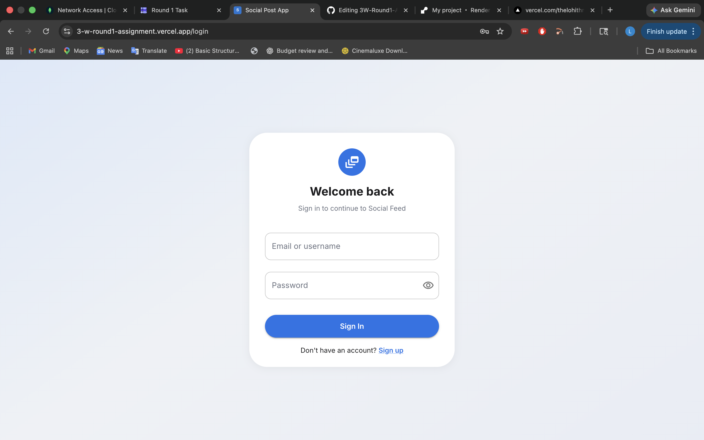
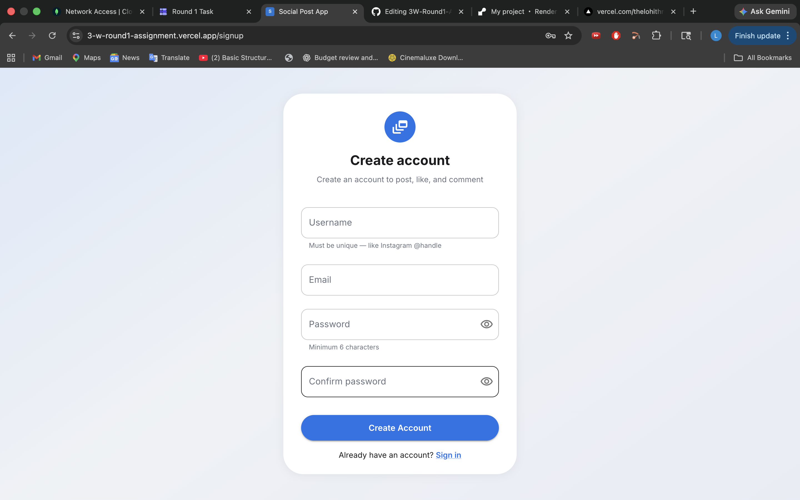
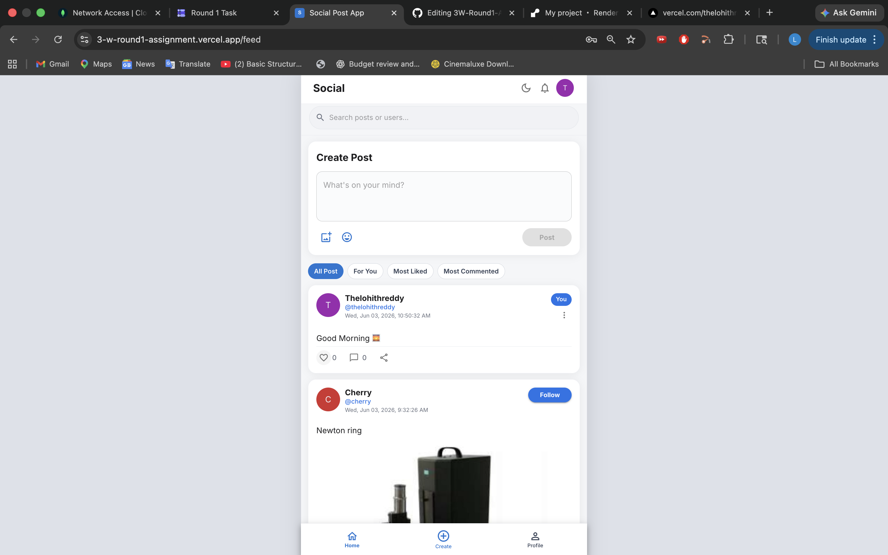
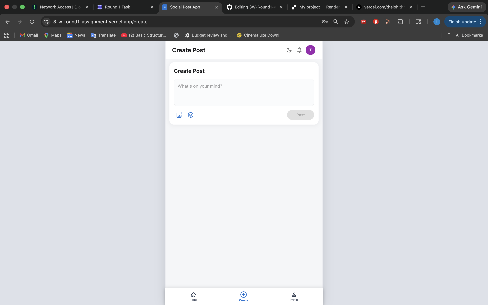
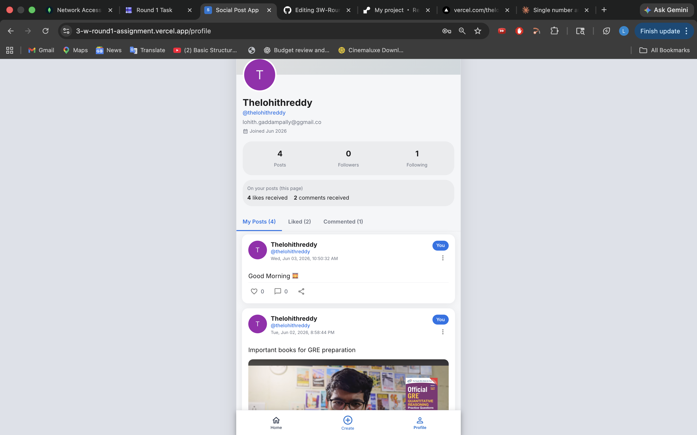
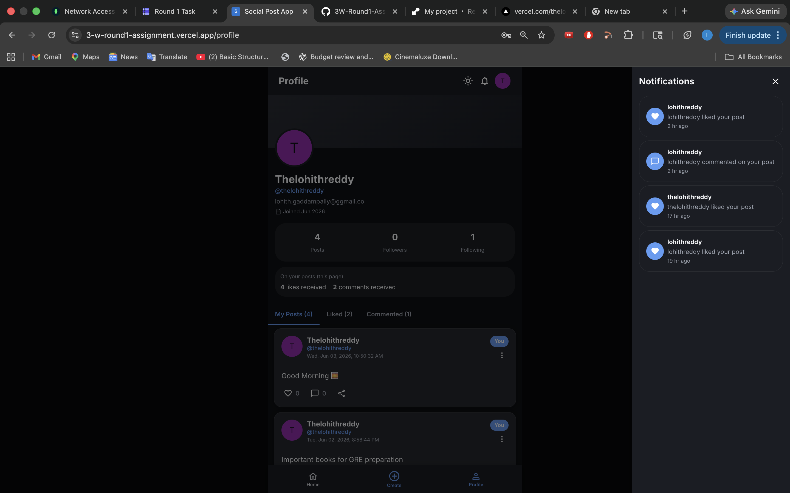

# Social Post SaaS

A production-ready full-stack social feed application built for the **3W Full Stack Internship Assignment**.

The app allows users to create accounts, log in, create text/image posts, view a public feed, like posts, comment on posts, manage profiles, and interact with a clean mobile-first social UI.

---

## Live Links

| Resource             | Link                                                   |
| -------------------- | ------------------------------------------------------ |
| GitHub Repository    | https://github.com/thelohithreddy/3W-Round1-Assignment |
| Frontend Live App    | https://3-w-round1-assignment.vercel.app               |
| Backend API          | https://threew-round1-backend.onrender.com             |
| Backend Health Check | https://threew-round1-backend.onrender.com/api/health  |

---
## Screenshots

### Login Page


### Signup Page


### Social Feed


### Create Post


### Profile Page


### Dark Mode and Notifications


---

## Features

### Core Assignment Features

* Secure user signup and login
* JWT-based authentication
* Persistent login on page refresh
* Create posts with text, image, or both
* Upload post images using Cloudinary
* Public feed showing posts from all users
* Like and unlike posts
* Add comments to posts
* Show total likes and comments
* Save usernames of users who liked or commented
* Delete own posts
* MongoDB database with only two main collections:

  * users
  * posts

### UI / UX Features

* Mobile-first social feed layout
* Clean card-based post design
* Responsive layout for desktop and mobile
* Dark mode support
* Profile page
* Bottom navigation
* Image preview before posting
* Comment modal / bottom sheet
* Like and comment count updates
* Loading and empty states
* Professional SaaS-style UI polish

---

## Tech Stack

| Layer          | Technology                                         |
| -------------- | -------------------------------------------------- |
| Frontend       | React, Vite, React Router, Axios, Material UI, CSS |
| Backend        | Node.js, Express.js, Mongoose                      |
| Authentication | JWT, bcryptjs                                      |
| Database       | MongoDB Atlas                                      |
| Image Upload   | Cloudinary, Multer                                 |
| Deployment     | Vercel, Render                                     |

---

## Project Structure

```text
3W-Round1-Assignment/
├── backend/
├── frontend/
├── README.md
└── .gitignore
```

---

## Local Setup

### Prerequisites

* Node.js 18+
* MongoDB Atlas account
* Cloudinary account
* Git

---

## Backend Setup

```bash
cd backend
npm install
```

Create a `.env` file inside the `backend` folder:

```env
PORT=5001
MONGO_URI=your_mongodb_atlas_connection_string
JWT_SECRET=your_jwt_secret
JWT_EXPIRE=7d
CLIENT_URL=http://localhost:5173

CLOUDINARY_CLOUD_NAME=your_cloudinary_cloud_name
CLOUDINARY_API_KEY=your_cloudinary_api_key
CLOUDINARY_API_SECRET=your_cloudinary_api_secret
```

Run backend locally:

```bash
npm run dev
```

Backend local URL:

```text
http://localhost:5001
```

Health check:

```text
http://localhost:5001/api/health
```

---

## Frontend Setup

```bash
cd frontend
npm install
```

Create a `.env` file inside the `frontend` folder:

```env
VITE_API_BASE_URL=http://localhost:5001/api
```

Run frontend locally:

```bash
npm run dev
```

Frontend local URL:

```text
http://localhost:5173
```

---

## Environment Variables

### Backend Environment Variables

| Variable              | Description                     |
| --------------------- | ------------------------------- |
| PORT                  | Backend server port             |
| MONGO_URI             | MongoDB Atlas connection string |
| JWT_SECRET            | Secret key for JWT signing      |
| JWT_EXPIRE            | JWT expiry time                 |
| CLIENT_URL            | Frontend URL for CORS           |
| CLOUDINARY_CLOUD_NAME | Cloudinary cloud name           |
| CLOUDINARY_API_KEY    | Cloudinary API key              |
| CLOUDINARY_API_SECRET | Cloudinary API secret           |

### Frontend Environment Variables

| Variable          | Description          |
| ----------------- | -------------------- |
| VITE_API_BASE_URL | Backend API base URL |

For deployed frontend:

```env
VITE_API_BASE_URL=https://threew-round1-backend.onrender.com/api
```

---

## API Summary

### Auth Routes

| Method | Route              | Description                |
| ------ | ------------------ | -------------------------- |
| POST   | `/api/auth/signup` | Register a new user        |
| POST   | `/api/auth/login`  | Login user                 |
| GET    | `/api/auth/me`     | Get current logged-in user |

### Post Routes

| Method | Route                     | Description           |
| ------ | ------------------------- | --------------------- |
| GET    | `/api/posts`              | Get public feed posts |
| POST   | `/api/posts`              | Create a new post     |
| PATCH  | `/api/posts/:id`          | Edit own post         |
| DELETE | `/api/posts/:id`          | Delete own post       |
| POST   | `/api/posts/:id/like`     | Like or unlike a post |
| GET    | `/api/posts/:id/comments` | Get post comments     |
| POST   | `/api/posts/:id/comments` | Add comment to a post |

### Health Route

| Method | Route         | Description                 |
| ------ | ------------- | --------------------------- |
| GET    | `/api/health` | Check backend server status |

---

## Deployment

### Frontend

The frontend is deployed on **Vercel**.

Live app:

```text
https://3-w-round1-assignment.vercel.app
```

### Backend

The backend is deployed on **Render**.

Backend API:

```text
https://threew-round1-backend.onrender.com
```

Health check:

```text
https://threew-round1-backend.onrender.com/api/health
```

### Database

MongoDB Atlas is used as the cloud database.

### Media Storage

Cloudinary is used for storing uploaded post images.

---

## Important Note

The backend is hosted on Render free tier. The first request after inactivity may take a few seconds because the server may need to wake up.

---

## Security Notes

* Passwords are hashed using bcryptjs before storing in MongoDB.
* JWT is used for protected routes.
* Secret keys and database credentials are stored in environment variables.
* `.env` files are not pushed to GitHub.
* Only `.env.example` files are included for reference.

---

## Author

**Lohith Reddy**

3W Full Stack Internship Assignment
